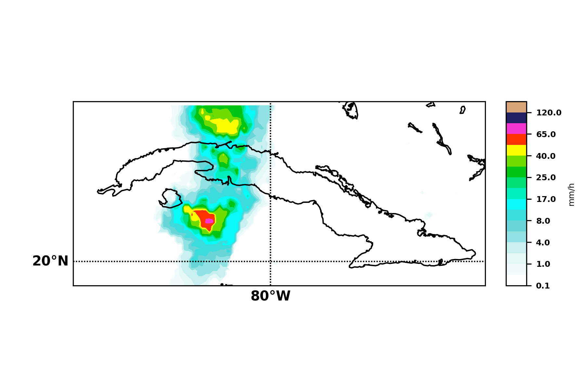
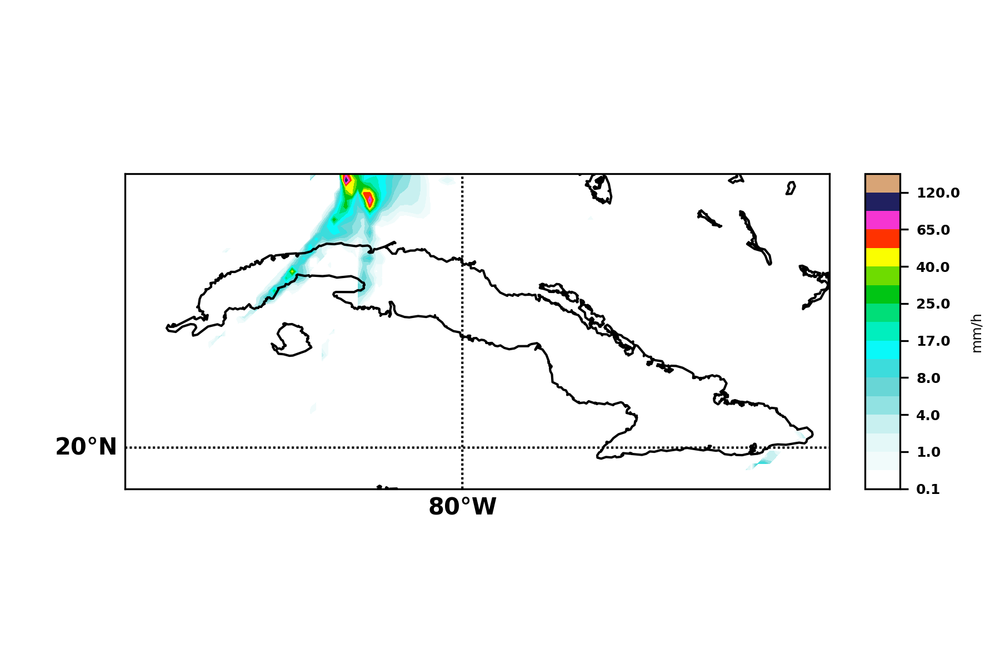

# Proyecto Final de Métodos Numéricos:

###  Título: Correción y análisis del pronóstico del SisPI mediante los datos deGPM.

#### Integrantes: Equipo 4.             Met-319.

- Claudia Hernández González.

- Yelena Corrales Cruz.

####                        Resumen:

La investigación se centra en la idea de realizar un ajuste de los datos pronosticados por el SisPI (precipitaciones) para el día 06/07/2021. Para ello se parte del previo conocimiento de las mediciones realizadas por el GPM para la misma fecha. 

Partimos de la generación de una malla que realiza un ajuste espacial y temporal (pone en la misma resolución) los datos recopilados por ambas fuentes, debido a que SisPI presenta 3km de resolución y registra la información cada 1h; mientras que GPM tiene 10km de resolución y almacena la información cada 0.5h. 

Se detalla además el proceso de generar una regresión lineal para poner corregir el pronóstico del SisPI y llegar posteriormente a resultados.

La investigación muestra los resultados de construir una malla de puntos utilizando el método de interpolación con datos del pronóstico de lluvia del  SisPI así como datos del satélite GPM. Esta malla de puntos consta de ### puntos generados por la intersección entre la latitud y la longitud. En los puntos de la malla se muestra la representación de la distribución espacial de los datos de precipitación obtenidos mediante el modelo numérico SisPI y el satélite GPM. Finalmente se evidencia que los datos analizados presentan.  

###### Palabras Claves: malla de  puntos, interpolación, precipitación, GPM, SisPI

#### Introducción :

La idea de poder pronosticar el tiempo mediante modelos numéricos se remonta desde 1920 pero no fue posible debido al poco desarrollo computacional. A comienzos del año 1950 se logró el primer trabajo en esta área pero no fue hasta 1955 que comenzó a funcionar de manera regular bajo un proyecto conjunto entre la Fuerza Aérea de los Estados Unidos y la Oficina de Meteorología. 

Los modelos numéricos para la predicción del tiempo hoy en día son de gran utilidad para ofrecer servicios meteorológicos debido a que sirven para anticipar las condiciones atmosféricas futuras. Los mismos son interpretados y ajustados para poder brindar información útil al centro de pronóstico nacional y los otros centros regionales. Los modelos utilizados pueden ser tanto globales como por ejemplo el GFS (Global Forecast System) y WRF (Weather Research and Forecast Model) o de área limitada ya que abarca solo una parte del planeta como por ejemplo el SisPI y el SPNOA para el Mar Caribe.  

El SisPI es un sistema computarizado de pronósticos meteorológicos a corto plazo que está adaptado a las condiciones meteorológicas del Mar Caribe. Este sistema es actualizado 4 veces diariamente y debido a su alta resolución espacial y temporal, permite la detección, seguimiento y pronóstico en tiempo real de la ocurrencia de fenómenos meteorológicos de alto impacto, como son los huracanes, con rangos de pronósticos entre 24 y 72 horas.

Un proyecto muy notable con el fin de realizar observaciones de precipitaión terráquea es el GPM (Global Precipitacion Measurement), esta misión es de sustancial utilidad ya que mejora pronósticos de acontecimientos extremos y proporciona información precisa y oportuna para beneficiar directamente a la sociedad a nivel global debido a que es una gran constelación de satélites como parte del programa NASA, que permite avanzar en nuestra comprensión del ciclo del agua y la energía de la Tierra. 

En esta investigación se utilizará el pronóstico del SisPI (3 km) para 06/07/21 que comprede un conjunto en total de 24 ficheros (se  recogen en intervalos de 1h),  y la estimación de la precipitación por satélite obtenida del GPM (10 km) que recogen datos de precipitación cada 30min,  se construirá una malla con la misma resolución para ambas fuentes de datos mediante un método de interpolación, luego se construirá un ajuste lineal con el pronóstico y los datos del GPM que permita corregir los errores del SisPI para todo la malla y finalmente compararemos los resultados entre el pronóstico del SisPI y el pronóstico del SisPI corregido por el método empleado con anterioridad para así valorar los resultados. 

##### Materiales y Métodos:

Para el desarrollo del trabajo se emplea el lenguaje de programación Python (en su versión 3.8), debido a las bondades que este brinda en el tratamiento y procesamiento de todo tipo de problemas matemáticos y trabajo numérico.
	Para la recopilación de los datos se emplean las librerías netCDF4 (Network Common Data Form) y h5py. La primera es una librería [opensource](https://github.com/Unidata/netcdf4-python) que se utilizó para leer los datos recopilados por sispy, a través de esta se puede obtener un objeto de tipo _Dataset_ con cada fichero, el cuál puede ser posteriormente analizado y procesado.
	Por otra parte, h5py, se utiliza para la lectura de los datos obtenidos del GPM recogidos en ficheros con formato HDF5(Hierarchical Data Format 5). La forma básica de organización de los datos en este tipo de archivos se recoge en la siguiente imagen:
.

numpy es otra herramienta muy útil que ofrece Python para el procesamiento y análisis de datos, esta también es utilizada en el trabajo en cuestión. numpy da soporte para crear vectores y matrices de grandes dimensiones, junto con una gran colección de funciones matemáticas de alto nivel para operar con ellas.

Mediante [Basemap](https://matplotlib.org/basemap/) perteneciente al módulo _mpl_toolkits.basemap_ se pudieron obtener los mapas para los diferentes estados reflejados en los datos. Basemap es una herramienta  para crear mapas usando Python de una manera sencilla y fácil. Es una extensión de matplotlib por lo que tiene todas sus funciones para crear visualizaciones d datos y agrega las proyeccciones geográficas y algunos conjuntos de datos para poder trazar líneas costeras, países, etc directamente desde la biblioteca.

Utilizando esta herramienta de Python, se hizo posible obtener imágenes del comportamiento de ambas mediciones, asi como de los datos obtenidos durante la interpolación.

La primera imagen muestra un corte realizado en una medición de GPM; mientras que la segunda es resultado de la interpolación en el horario 12.00 - 13.00 del día analizado.

La construcción de la regresión lineal es un aspecto que consideramos de suma importancia y que debe ser tratado con especial interés. La regresión lineal nos permitió obtener una función polinómica para corregir los datos del sispy a partir de los datos del GPM. El algoritmo o el método empleado para obtener la regresión, es sumamente conocido y es muy útil en el mundo de la inteligencia artificial (dentro de los métodos de aprendizaje supervisado) y análisis estadísticos. Una regresión no es otra cosa que una función de la forma: 
$$
Y = \beta_0 + \beta_1X_1 + \dots + \beta_mX_m + e
$$
donde $Y$ es la variable dependiente o variable respuesta, las precipitaciones en este caso, y $X_1$, $X_2$ , $\dots$  ,$X_m$  son las variables independientes o regresoras. Por otra parte $\beta_0$, $\beta_1$, $\dots$, $\beta_m$ son los parámetros del modelo y miden las influencia que las variables regresoras tienen sobre la resupesta. 

En el problema que nos involucra las variables independientes fueron: latitud, longitud y el tiempo; mientras que los parámetros ($\beta_i$) son: [ 7.34587889e+01  7.43377164e-01 -6.29629126e-02]. 

El funcionamiento del modelo, una vez conocida la función, es relativamente simple; solo se necesita proporcionar las variables de entrada (latitud, longitud y tiempo) y esta brindará como salida las precipitaciones referentes a esas condiciones. 

En este tipo de problemas, los datos empleados para constriur la regresión (_dataset_) son sumamante importantes, ya que estos aseguran la confiablidad de la regresión y muchas veces, la mala elección de los mismos o la poca (o mucha) cantidad de estos puede traer problemas que nos afecten: dígase _overfit_ o _underfit_. 

Para el análisis de los resultados, se verifica el error promedio entre las precipitaciones obtenidas por el SisPI (el pronóstico en este caso) y las que se obtinen  con los datos corregidos por medio de la regresión. 

##### Resultados:

El análisis de los resultados se centra en el chequeo del error obtenido, para ellose detecta las diferencias entre el pronóstico de SisPI y el ajuste de estos mismos datos por medio de la regresión lineal construida en el desarrollo del trabajo. Luego de analizar estas diferencias, en promedio, tenemos que los datos ajustados difieren aproximadamente en $\pm$3 mm en cuanto a precipitación, recalcar en este punto que siempre estamos llegando a estimaciones y resultados aproximados.

Junto al informe que se brinda se entrega además la carpeta _data_ que recoge, además de los datos analizados, los resultados obenidos durante todo el proceso; con resultados nos referimos a todas las imágenes que se generaron en cada etapa y los ficheros _.dat_ que recogen las precipitaciones registradas en todos los intervalos analizados así los puntos de latitud y longitud que analizadas por ambas fuentes de datos. Constituye un extra, en la comprensión del trabajo, dirigirse a tal ubucación y comprobar lo expuesto en el mismo.

##### Conclusiones:  

Luego de terminado el análisis del comportamiento de la variable meteorológica "precipitación" a través de la construcción de una malla de puntos con datos obtenidos del satélite GPM y los datos del modelo numérico SisPI mediante un método de interpolación se pudo comparar, valorar y corregir el pronóstico dado inicialmente por el SisPI con el pronóstico del resultado de aplicar el método empleado de interpolación. Consideramos que los resultados fueron bastante aceptables, teniendo en cuenta la incertidumbre que puede existir en el _dataset_ que se usó para construir el modelo de regresión lineal; se intentó por todos los medios ajustar lo mayor posible el modelo y usar las variables adecuadas para evitar errores clásicos de overfit y underfit presentes en este tipo de modelos. 
